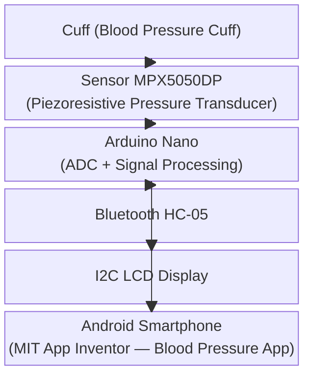
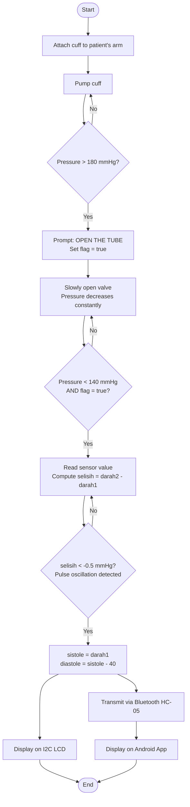

# Digital Tensimeter — Android-Based Blood Pressure Monitor via Bluetooth

An Arduino Nano project that measures blood pressure (systole and diastole) using the Korotkoff/oscillometry method, displays results on an I2C LCD, and transmits data wirelessly to an Android app via the HC-05 Bluetooth module.

---

## System Architecture



---

## Measurement Flowchart



---

## Hardware

| Component | Specification | Notes |
|---|---|---|
| Microcontroller | Arduino Nano | ATmega328P |
| Pressure sensor | MPX5050DP | Piezoresistive, 0–50 kPa, 5V supply |
| Bluetooth module | HC-05 | Serial UART, paired with Android |
| Display | I2C LCD | 16×2 or 20×4 |
| Cuff & pump | Standard sphygmomanometer cuff | Manual pump with valve |

### I2C LCD Pin Mapping

| I2C Pin | Arduino Nano Pin |
|---------|-----------------|
| GND | GND |
| VCC | 5V |
| SDA | A4 |
| SCL | A5 |

---

## Sensor Signal Processing

The MPX5050DP outputs an analog voltage proportional to pressure. The Arduino ADC converts this to a digital value, which is then converted to mmHg in two steps:

**Step 1 — Voltage:**
```c
voltage = sensorValue * (voltageMax / sensorMax);
```

**Step 2 — kPa (from MPX5050DP datasheet formula):**
```c
kpa = ((voltage / kpaRangeTopVoltage) - 0.04) / 0.018;
```

**Step 3 — mmHg (1 kPa = 7.500617 mmHg):**
```c
tekanan_darah = kpa * 7.500617;
```

---

## Detection Algorithm

### Systole Detection

Blood flow stops when cuff pressure exceeds systolic pressure. As the valve releases and pressure drops below 140 mmHg, the returning pulse creates a small oscillation in the sensor reading. The first negative change greater than 0.5 mmHg is taken as the systolic pressure:

```c
if (tekanan_darah > 180) {
    Serial.print("OPEN THE TUBE");
    tanda = true;
}

if ((tekanan_darah < 140) && (tanda == true)) {
    darah1  = tekanan_darah;
    selisih = darah2 - darah1;
    darah2  = darah1;

    if (selisih < -0.5) {
        sistole  = darah1;
        diastole = sistole - 40;  // fixed pulse pressure offset
    }
    tanda = false;
}
```

### Diastole Estimation

Diastole is estimated by subtracting the average adult pulse pressure (40 mmHg) from systole:

```
diastole = sistole - 40
```

> **Limitation**: This is a fixed offset. Individual pulse pressure varies (normal range: 30–50 mmHg), so diastole accuracy is lower than systole accuracy. Users should be relaxed during measurement to minimize noise.

---

## Android App

Built with **MIT App Inventor** using drag-and-drop logic blocks.

**Usage steps:**
1. Open the **Blood Pressure** app on the Android device
2. Tap **Select Device** and choose the HC-05 Bluetooth connection
3. Pump the cuff — the app will display "OPEN THE TUBE" when ready
4. Open the valve; systole and diastole results appear in the **Result** field

---

## Project Structure

```
.
├── tensimeter.ino          # Arduino sketch (ADC, detection logic, BT + LCD output)
├── BloodPressure.aia       # MIT App Inventor project file (Android app)
└── README.md
```

---

## References

- Porth, C. (2013). *Alteration in Blood Pressure. Essentials of Pathophysiology: Concepts of Altered Health States.*
- Yazid, N. (2011). *Pemantau Tekanan Darah Digital Berbasis Sensor Tekanan MPX2050GP.*
- Kapse, C. (2013). *Auscultatory and Oscillometric Methods of Blood Pressure Measurement: A Survey.*
- Guna, W.M. (2012). *Tensimeter Digital Dengan Outputan Suara.*
- Permana, A.A. (2015). *Hubungan Tekanan Darah Sistolik Pada Penderita Infark Miokard Akut Segment ST Elevasi.*

---

## Team

Ahmad Fauzi H.C. · Windy Deftia M. · Ainun Arsy S. · Grace Lamria P.
S1 Teknik Biomedik, Institut Teknologi Sepuluh Nopember (ITS) Surabaya · 2019
